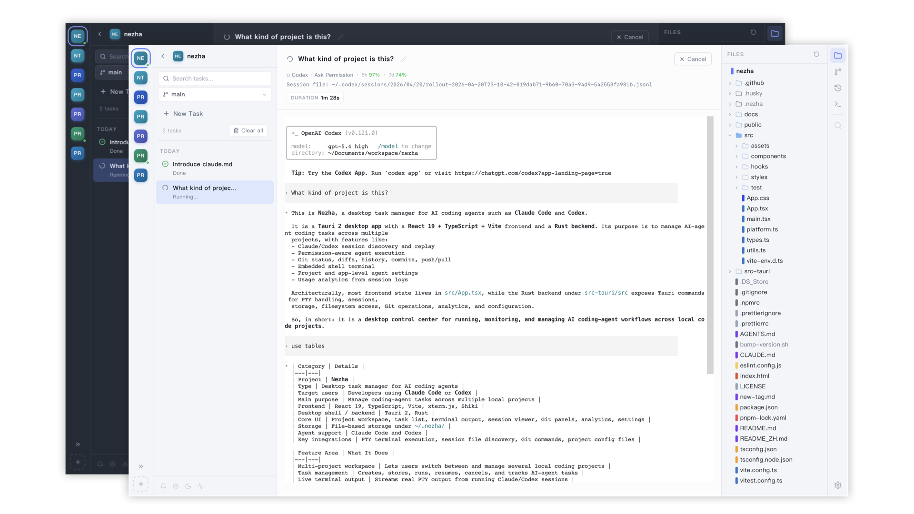
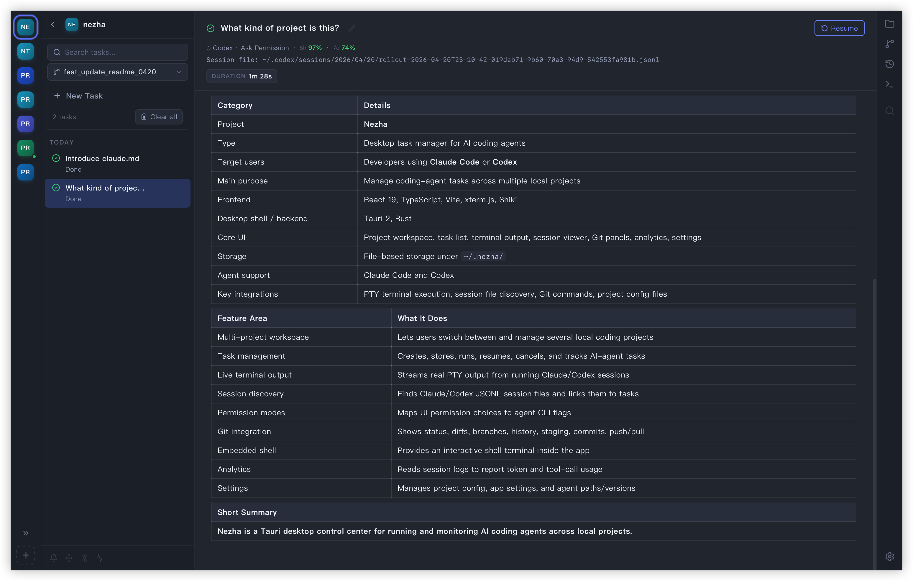
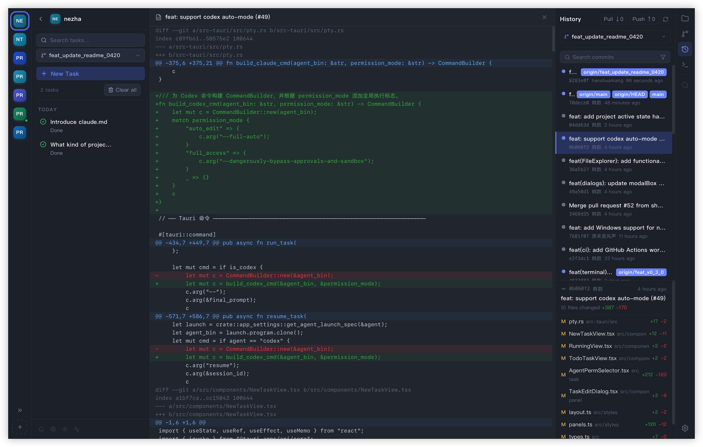

<p align="center">
  
</p>

<h1 align="center">Nezha: An Agent-First Application For Vibe Coding </h1>

<p align="center">
  Parallelize your AI coding agents. Claude Code + Codex, running together.
</p>

<p align="center">
  Multi-project Workspace · Fast Switching Between VibeCoding Tasks · Real-time Terminal · Session Auto-discovery · Native Git Integration · Lightweight Code Editor
</p>
<p align="center">
  <a href="https://github.com/hanshuaikang/nezha/actions/workflows/checks.yml"></a>
  <a href="https://github.com/hanshuaikang/nezha/releases"></a>
  <a href="https://github.com/hanshuaikang/nezha/stargazers"></a>
</p>

<p align="center">
  <a href="https://www.producthunt.com/products/nezha-2?embed=true&utm_source=badge-featured&utm_medium=badge&utm_campaign=badge-nezha" target="_blank" rel="noopener noreferrer">
    
  </a>
  <a href="https://hellogithub.com/repository/hanshuaikang/nezha" target="_blank" rel="noopener noreferrer">
    
  </a>
</p>

<p align="center">
  
</p>

Nezha is an Agent-First Vibe Coding desktop application built for true parallel programming. It lets Claude Code and Codex run together across multiple projects, while unifying task lifecycle tracking, a native terminal experience, session playback, code browsing, and a complete Git workflow in one interface. Say goodbye to constantly toggling between terminals, editors, Git clients, and session logs. With just a few clicks, you can instantly switch contexts between different projects or tasks. Moreover, with an installation package size of just 7MB, Nezha completely eliminates the bulkiness associated with traditional IDEs.

[**中文文档 (Chinese Documentation)**](./README_ZH.md)

## Why Nezha?

Traditional IDEs and editors like VS Code are fundamentally designed with the human developer at the center. In the era of manual programming, features such as plugin ecosystems, refactoring tools, and variable autocomplete existed to enhance individual coding efficiency. However, as AI takes over more of the actual code generation, the act of programming is becoming increasingly parallelized—a paradigm shift that was previously unimaginable. Yet, human attention remains limited. How to rapidly track and manage tasks across multiple projects concurrently is precisely the challenge Nezha solves.

Nezha is engineered with an **Agent-First** philosophy. It features a built-in terminal that directly integrates native Claude Code and Codex, so your AI coding agents can work in parallel instead of waiting in sequence. Building upon this foundation, it incorporates a comprehensive task system, Git integration, a terminal emulator, and a code editor. For everyday tasks, you no longer need to launch a heavy IDE; you can achieve a closed-loop workflow—from task delegation and code review to final code submission—all without interrupting your ongoing work in other projects.

## Installation

Before using Nezha, ensure that you have installed Claude Code / Codex. 

Upon the first installation on macOS, you might encounter the following security prompt: *"“NeZha” is damaged and can’t be opened. You should move it to the Trash."* This occurs because the installation package is unsigned. You can easily resolve this by executing the following command in your terminal:

```bash
xattr -rd com.apple.quarantine /Applications/nezha.app
```

## Core Features

- **Centralized Multi-Tasking**: Manage multiple projects and VibeCoding tasks simultaneously within a single interface. The virtual terminal runs native Claude Code / Codex, providing real-time output and interactive experience that rivals a local terminal.
- **Intelligent Session Management**: Automatically detects and associates Claude Code / Codex sessions. The system intelligently alerts users when tasks require manual confirmation or input.
- **Visualized Session History**: Intuitively view the detailed interaction history between you and Claude Code / Codex directly within the UI. You can seamlessly resume interrupted tasks at any time.
- **Polished Interface Design**: A carefully crafted visual style balances information density with clarity, while built-in light and dark themes keep the workspace comfortable day and night.
- **Native Git & Code Editing**: Features native Git integration with AI-assisted Git commit message generation. The built-in lightweight code and Markdown editors provide syntax highlighting for all major programming languages.
- **Usage Analytics**: Provides weekly statistics on Token consumption and tool invocations, helping you quantify agent efficiency and track operational costs.

## 🌟 Feature Overview

### 🗂️ Multi-Project Workspace

> **One-click context switching between VibeCoding tasks across multiple projects.**

- ✨ **Quick Switch**: Use the left-hand project navigation bar to seamlessly toggle between multiple codebases with a single click, while your terminals remain actively running in the background.
- 🔄 **Real-Time Synchronization**: Task statuses are synchronized in real-time across all projects. Projects containing sessions that await user confirmation are explicitly highlighted with a yellow indicator.
- 🚀 **Multi-Agent Support**: Run multiple Claude Code / Codex instances simultaneously. Each instance can independently manage its own set of tasks.

<p align="center">
  
  
</p>

### 📊 Full Task Lifecycle Visualization

> **Comprehensive tracking for active and pending tasks.**

- 🎯 **Transparent Statuses**: Track tasks seamlessly from creation and execution to waiting for input and final completion.
- ⏪ **Session Playback & Recovery**: Upon task completion, the corresponding session records are automatically visualized. Supports task resumption at any time.
- 🧠 **Personalized Configuration**: The task input interface supports rich interactions including `@` mentions, image pasting, Pre-Prompts, and more.

<p align="center">
  
</p>

### 📝 Built-in Code & Markdown Editors

> **A lightweight yet uncompromising coding experience.**

- 📁 **Clear Structure**: A complete file tree browsing experience with rapid directory expansion and collapse.
- 🎨 **Status Highlighting**: Real-time Git status annotations ensure file changes are identifiable at a glance.
- 💅 **Professional Highlighting**: Professional-grade syntax highlighting and editing capabilities powered by Shiki and CodeMirror.

<p align="center">
  
  
</p>

### 🌳 Git Integration

> **Built-in Git integration for branch management, code commits, and AI message generation.**

- 📦 **Git Diff View**: Intuitively review staged and unstaged modifications with comprehensive code highlighting.
- 🕒 **Git Logs**: Easily navigate commit history and inspect detailed diffs for any given commit.
- 🤖 **AI Git Messages**: Smart assistance for generating Commit Messages that adhere to your project's formatting standards.
- 🚦 **Branch Management**: Full support for creating, switching, merging, and deleting branches, alongside branch history visualization.

<p align="center">
  
</p>

### 🎨 Carefully Crafted UI Style with Light and Dark Modes

<p align="center">
  
  
</p>

## 🗺️ Roadmap

| <small>Module</small> | <small>Planned Feature</small> | <small>Status</small> |
| --- | --- | :---: |
| <small>**Cross-Platform**</small> | <small>Windows Support</small> | <small>⏳ Planned</small> |
| | <small>Linux Support</small> | <small>⏳ Planned</small> |
| <small>**Agent Config**</small> | <small>Visual Configuration Management</small> | <small>⏳ Planned</small> |
| | <small>Multi-Account Management</small> | <small>⏳ Planned</small> |
| <small>**Workflow**</small> | <small>New Code Review View</small> | <small>⏳ Planned</small> |
| | <small>Git Worktree Support</small> | <small>⏳ Planned</small> |

## 🙏 Acknowledgments

The creation of Nezha was made possible by the following outstanding open-source projects. We extend our deepest gratitude to them:

- [Tauri](https://github.com/tauri-apps/tauri) - Build smaller, faster, and more secure desktop applications with a web frontend.
- [React](https://github.com/facebook/react) - The library for web and native user interfaces.
- [xterm.js](https://github.com/xtermjs/xterm.js) - A terminal for the web.
