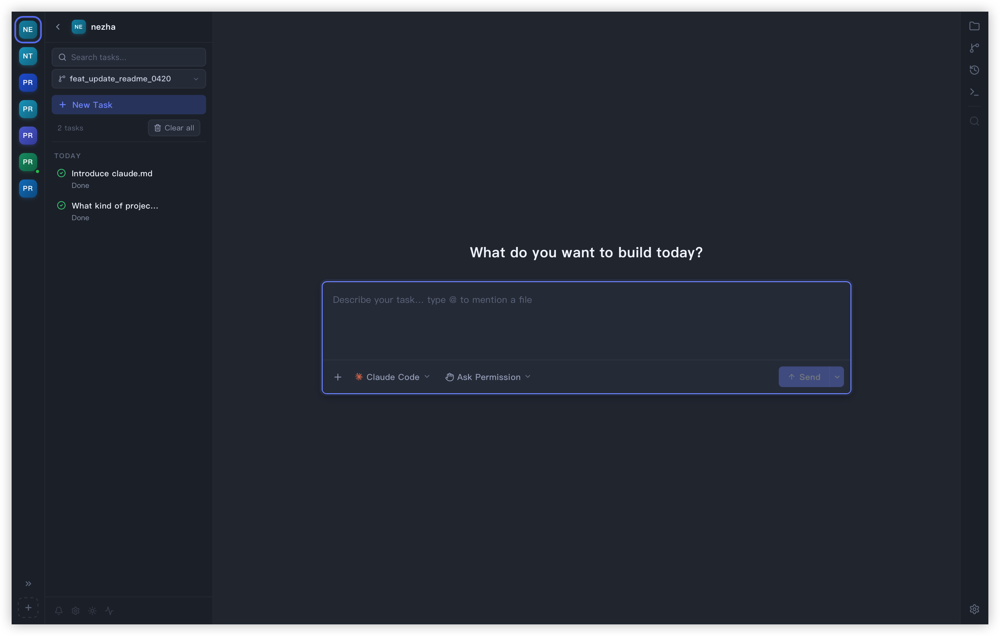
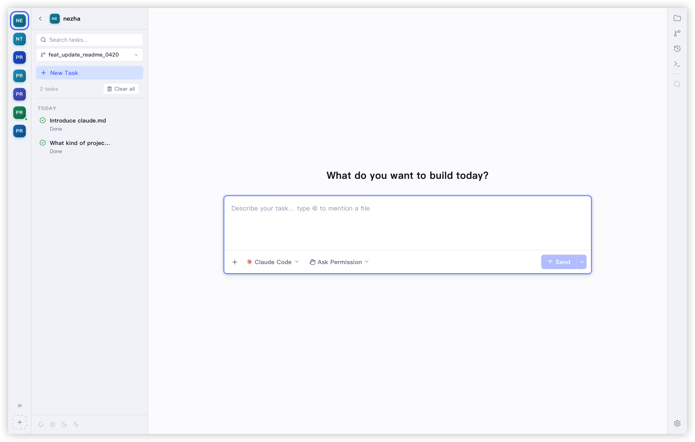

<p align="center">
  
</p>

<h1 align="center">哪吒(Nezha): 三头六臂，并发编程</h1>

<p align="center">
  三头六臂, 你的真正 Agent 优先的轻量级并发 VibeCoding 效率工具
</p>

<p align="center">
  多项目工作区, 快速切换多个项目的 vibecoding 任务 · 实时终端 · 会话自动发现 · 原生 Git 集成 · 轻量级代码编辑器
</p>
<p align="center">
  <a href="https://github.com/hanshuaikang/nezha/actions/workflows/checks.yml"></a>
  <a href="https://github.com/hanshuaikang/nezha/releases"></a>
  <a href="https://github.com/hanshuaikang/nezha/stargazers"></a>
</p>

<div align="center">
  <table>
    <tr>
      <td align="center">
        <a href="https://www.producthunt.com/products/nezha-2?embed=true&utm_source=badge-featured&utm_medium=badge&utm_campaign=badge-nezha" target="_blank" rel="noopener noreferrer">
          
        </a>
      </td>
      <td align="center">
        <a href="https://hellogithub.com/repository/hanshuaikang/nezha" target="_blank" rel="noopener noreferrer">
          
        </a>
      </td>
    </tr>
  </table>
</div>

<p align="center">
  
</p>

Nezha 是一款专为 AI 编程场景打造的桌面应用。它把多项目管理、任务生命周期追踪、原生终端体验、会话回放、代码浏览和完整 Git 工作流整合到同一个界面里，让你不必在终端、编辑器、Git 工具和会话记录之间来回切换。只需要通过鼠标点击，就可以瞬间切换到不同的项目或任务。同时安装包只有 7M 大小，告别 IDE 的笨重。

## 为什么是 Nezha

传统的 IDE 和 VS Code 这样的编辑器本质上是以开发者为核心设计的，在古法编程时代，插件系统，重构，变量联想等诸多功能都是为了提升效率而存在。而现在 AI 写的代码越来越多，写代码本身真的开始并行了，这在以前是不敢想的事情，但是人的注意力是有限的，如何快速跟踪多个项目的任务，就是哪吒需要解决的事情。

哪吒以 Agent 优先设计，内置终端直接集成原生 Claude Code 和 Codex。并在此之上集成 任务系统，Git, 终端和代码编辑器。使得对于轻度需求无需打开笨重的 IDE 即可完成任务下发，代码 Review，代码提交等操作的闭环，而且不会打断你在其他项目进行中的工作。


## 安装 Nezha
在使用哪吒之前你需要先安装好 Claude Code / Codex, 初次安装会遇到"“NeZha”已损坏，无法打开。 你应该将它移到废纸篓。"。这是由于安装包未签名导致的，执行以下语句即可:

``` bash
xattr -rd com.apple.quarantine /Applications/nezha.app
```

## 核心功能

- 在单一界面中同时管理多个项目与多个 vibecoding 任务，虚拟终端运行原生的 Claude Code / Codex, 提供接近本地终端的实时输出与交互体验.
- 自动识别并关联 Claude Code / Codex 会话, 当任务需要手动确认时，自动提醒用户。
- 可视化会话历史，你可以直接在页面上可视化查看你和 Claude Code / Codex 每一次的会话详情，并随时 Resume 任务。
- 精选打磨的 UI 风格，兼顾信息密度与可读性，并内置白天/黑夜主题模式，长时间使用也更舒适。
- 原生集成 Git, AI 生成 Git Message。 原生集成轻量级代码编辑器和Markdown编辑器，支持所有常见编程语言代码高亮。
- 按周统计 Token 与工具调用，帮助量化智能体效率与成本。
## 🌟 功能概览

### 🗂️ 多项目工作区

> **多项目工作区, 一键切换多个项目的 vibecoding 任务**

- ✨ **快速切换**：左侧项目导航栏，一键在多个代码库间无缝切换，终端会在后台保持活跃。
- 🔄 **实时同步**：任务状态跨项目实时同步，待确认的会话对应的项目会亮黄灯显式提醒。
- 🚀 **多Agent支持**：支持同时运行多个 Claude Code / Codex 实例，每个实例可以独立管理任务。

<p align="center">
  
  
</p>

### 📊 任务全生命周期可视化

> **支持任务/待办任务**

- 🎯 **状态透明**：从创建、运行、等待输入到最终完成。
- ⏪ **会话可视化展示和恢复**：任务完成自动可视化展示对应的会话记录，支持随时恢复。
- 🧠 **个性化配置**：任务输入框支持 @ 操作，图片粘贴，Pre Prompt 等操作。

<p align="center">
  
</p>


### 📝 内置代码编辑器与MarkDown编辑器

> **轻量却不妥协的编码体验**

- 📁 **结构清晰**：完整的文件树浏览体验，支持目录的快速展开与折叠。
- 🎨 **状态高亮**：Git 状态实时标注，文件变更一览无余。
- 💅 **专业高亮**：基于 Shiki / CodeMirror 打造的专业级语法高亮查看与编辑体验。

<p align="center">
  
  
</p>

### 🌳 Git 集成

> **内置 Git 集成，分支管理，代码提交，Git Message 生成**

- 📦 **Git Diff 视图**：直观查看暂存与未暂存的改动，支持代码高亮。
- 🕒 **Git Logs**：轻松浏览提交历史，查看任意一次 Commit 的详尽差异。
- 🤖 **Git Message 生成**：智能辅助生成契合项目规范的 Commit Message。  
- 🚦 **分支管理**：支持创建、切换、合并、删除分支，以及查看分支历史。

<p align="center">
  
</p>

### 🎨 精心打磨的 UI 风格，支持白天和黑夜模式

<p align="center">
  
  
</p>

 ## 后续计划
| <small>模块</small> | <small>计划功能</small> | <small>状态</small> |
| --- | --- | :---: |
| <small>**跨平台支持**</small> | <small>支持 Linux 平台</small> | <small>⏳ 规划中</small> |
| <small>**Agent 配置**</small> | <small>可视化配置管理</small> | <small>⏳ 规划中</small> |
| | <small>多账号管理</small> | <small>⏳ 规划中</small> |
| <small>**开发流程**</small> | <small>新增 Code Review 视图</small> | <small>⏳ 规划中</small> |
| | <small>新增 Git Worktree 支持</small> | <small>⏳ 规划中</small> |


## 🙏 鸣谢

Nezha 的诞生离不开以下优秀的开源项目，向它们致敬：

- [Tauri](https://github.com/tauri-apps/tauri) - 构建更小、更快、更安全的桌面应用
- [React](https://github.com/facebook/react) - 构建用户界面的 JavaScript 库
- [xterm.js](https://github.com/xtermjs/xterm.js) - 强大的 Web 终端组件

感谢以下自媒体对本项目的关注和转发(以下排名不分先后), 大家感兴趣的话可以关注下他们 ～

| 平台 | 账号 |
| --- | --- |
| 推特 | [@aigclink](https://x.com/aigclink)、[@QingQ77](https://x.com/QingQ77) |
| 公众号 | 码问 |


### 👬 友情链接
<a href="https://linux.do">Linux.do</a>
